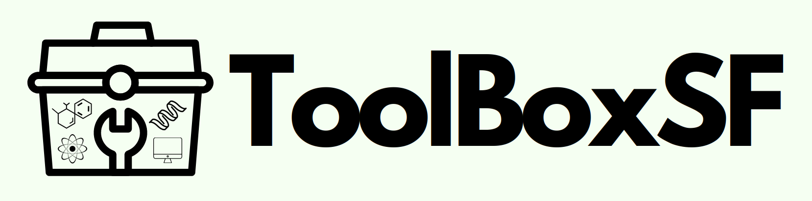

# ToolBoxSF - Robustly interrogating machine learning based scoring functions: what are they learning?

## Introduction

This repository contains the raw code and built singularity containers for the scoring function platform and toolbox described in the manuscript "Robustly interrogating machine learning based scoring functions: what are they learning?" by Guy Durant, Fergus Boyles, Kris Birchall, Brian Marsden, and Charlotte M. Deane.

## Installation

Singularity containers for each scoring function and baseline models in the paper can be found at the following links:

- [RFScore](https://drive)
- [Pafnucy](https://drive)
- [OnionNet-2](https://drive)
- [PointVS](https://drive)
- [SIGN](https://drive)
- [Ligand Bias Model](https://drive)
- [Protein Bias Model](https://drive)
- [Both Bias Model](https://drive)

They can be all installed using the following commands:

```bash
mkdir models
cd models
wget <LINK_TO_SINGULARITY_CONTAINER>
cd ..
```

The singularity containers can be built from scratch using .def files provided in the singularity folder with the following commands:

```bash
singularity build <SINGULARITY_CONTAINER_NAME>.sif <SINGULARITY_RECIPE_FILE>.def
```

## Data

PDBbind 2020 general set and CASF-2016 benchmark set can be downloaded from the following links:

- [PDBbind 2020 general set](http://www.pdbbind.org.cn/download/pdbbind_v2020_general.tar.gz)
- [CASF-2016 benchmark set](http://www.pdbbind.org.cn/download/CASF-2016.tar.gz)

The data can be processed as described in the paper using the following scripts:

```bash
python scripts/process_pdbbind.py --data_dir <PDBBIND_DATA_DIR> --csv_file <CSV_FILE> --output_dir <OUTPUT_DIR>
```

The CSV files and docked poses for the test sets can be downloaded from the following link:

- [CSV files and docked poses for the test sets](https://drive)

```bash
wget <LINK_TO_CSV_FILES_AND_POSES>
tar -xvf <TAR_FILE>
```

## Usage

It is recommended to use the singularity containers to run the scoring functions. The following commands can be used to run the scoring functions:

For training:

```bash
singularity exec --nv -B test_data:/<GITHUB_REPO_NAME>/data --home $(dirname $PWD) <SINGULARITY_CONTAINER_NAME>.sif bash toolboxsf --train --csv_file ../training_csvs/pdbbind_2020_general_crystal_all.csv --data_dir ../pdbbind_2020_general --model_name <MODEL_NAME>
```

For validation:

```bash
singularity exec --nv -B test_data:/<GITHUB_REPO_NAME>/data --home $(dirname $PWD) <SINGULARITY_CONTAINER_NAME>.sif bash toolboxsf --predict --val_csv_file ../benchmarks/csv_files/casf_2016_crystal.csv --val_data_dir ../pdbbind_2020_general --model_name <TRAINED_MODEL_NAME>
```

The following table relates the github repo names (forks or reimplementtions of the original code) to the singularity container names:

| Github Repo Name | Singularity Container Name |
| ---------------- | -------------------------- |
| rfscore          | rfscore.sif                |
| Pafnucy          | pafnucy.sif                |
| OnionNet-2       | onionnet.sif               |
| PointVS          | pointvs.sif                |
| SIGN             | sign.sif                   |
| ligand_bias      | ligand_bias.sif            |
| protein_bias     | protein_bias.sif           |
| both_bias        | both_bias.sif              |
